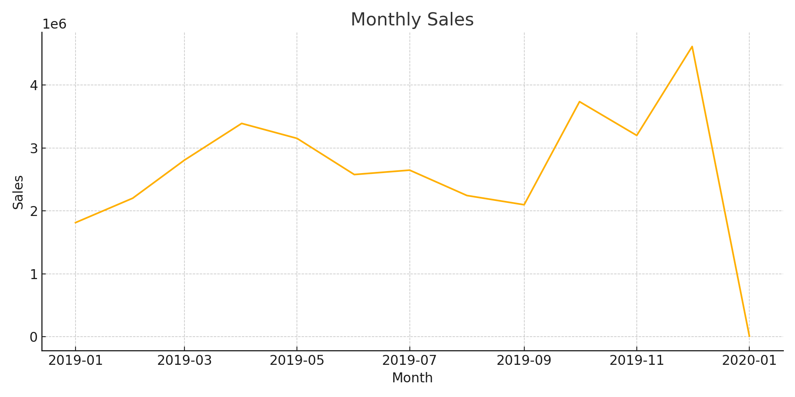
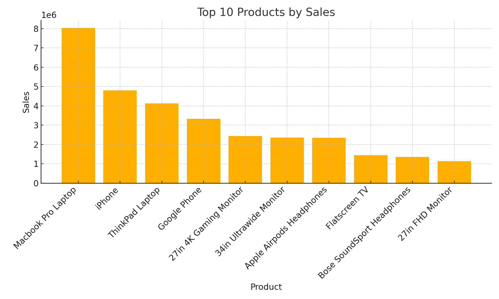
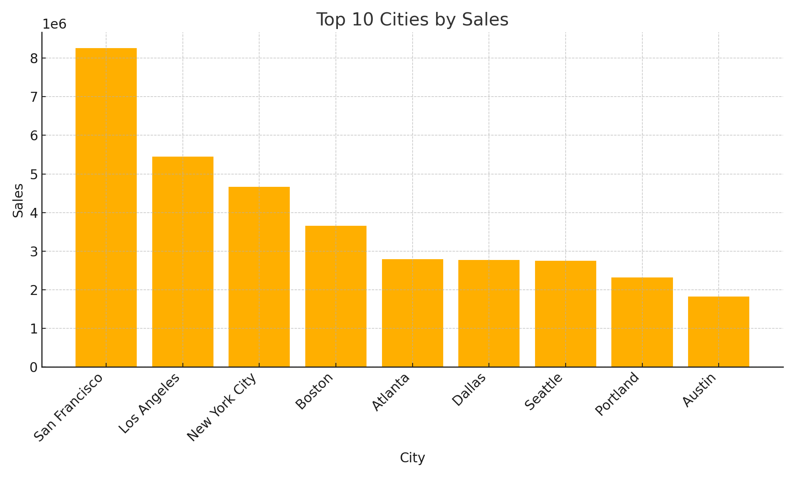
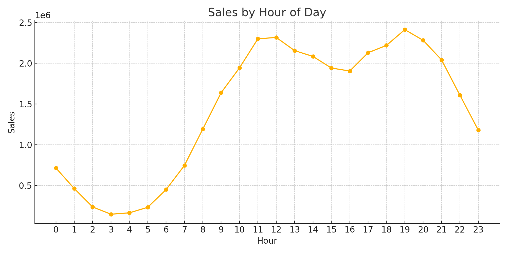
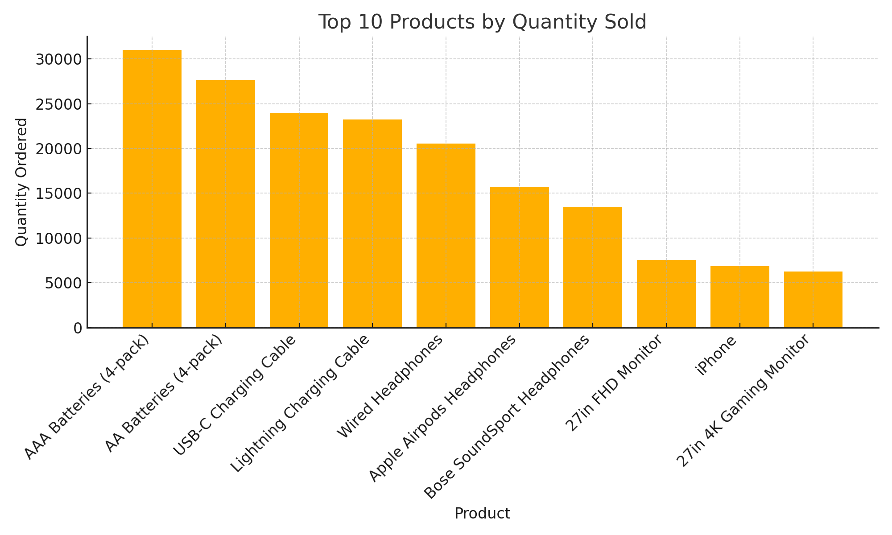
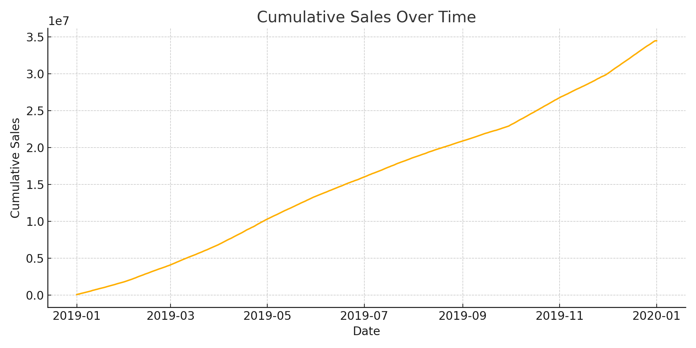
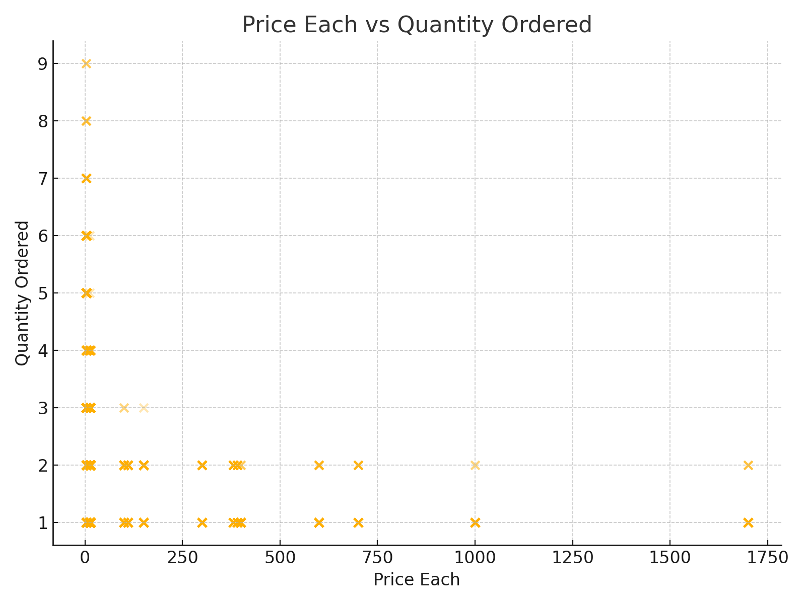

# Sales Forecasting and Analysis

## 📌 Project Overview
This project analyzes historical sales data and applies machine learning models to **forecast sales for Jan–Mar 2020**.  
The goal is to demonstrate practical forecasting for business decision-making, focusing on **inventory planning, marketing, and financial insights**.

This work was part of my **Sales Performance & Forecasting project**, where I combined **SQL, Python, and Power BI** to deliver both **predictive models** and **interactive dashboards**.

---

## 📊 Data
- **Source:** Simulated company sales dataset (transactions across multiple months).  
- **Period:** Forecasting window — **January to March 2020**.  
- **Features:** Dates, transactions, sales revenue, product categories.  
- **Note:** Due to privacy, raw datasets are not uploaded. Sample data and scripts are provided for reproducibility.

---

## ⚙️ Methodology
1. **Data Preparation (SQL + Python)**
   - Queried and cleaned historical data in **PostgreSQL**.  
   - Handled missing values, created time-series features, and aggregated sales.  

2. **Exploratory Data Analysis (EDA)**
   - Identified sales trends, seasonality, and outliers.  
   - Visualized revenue by month, product categories, and customer segments.  

3. **Forecasting Models (Python)**
   - **ARIMA** — captured trends and seasonality.  
   - **Prophet (Facebook)** — robust model for holidays/seasonal effects.  
   - **XGBoost** — machine learning approach for regression-based forecasting.  

4. **Visualization (Power BI)**
   - Built interactive dashboards for stakeholders to explore actual vs. forecasted sales.  
   - Included KPIs, trend charts, and drill-downs by product.

---

## 🚀 Results
- Generated accurate forecasts for **Jan–Mar 2020**.  
- Compared performance of ARIMA, Prophet, and XGBoost.  
- Created clear **Power BI dashboards** that highlight trends and support business strategy.  

---

## 🛠 Tools & Technologies
- **Programming:** Python (Pandas, NumPy, Scikit-learn, Statsmodels, Prophet, XGBoost)  
- **Database:** SQL (PostgreSQL)  
- **Visualization:** Power BI, Matplotlib, Seaborn  
- **Version Control:** Git & GitHub  

---

## 📂 Project Structure  
sales-forecasting-and-analysis/
- │── notebooks/ # Jupyter/Colab notebooks for exploration and modeling
- │── src/ # Python scripts for data processing & forecasting
- │── data/ # (excluded) raw/private data
- │── outputs/ # charts, model results, and exports
- │── assets/ # images for README and documentation
- │── README.md # project documentation
- │── requirements.txt # Python dependencies
│── .gitignore # files to ignore


---

## 📈 Dashboard
This Power BI dashboard highlights key metrics, trends, and insights from the sales data.

- KPIs: Total Sales, Products Sold, Avg Order Value  
- Monthly sales trend analysis  
- Top 5 cities by sales  
- Top 5 products by sales


---

## ▶️ How to Run

Follow these steps to set up and run the project locally:

1. **Clone the repository**
   ```bash
   git clone https://github.com/Rohan-Thube0253/sales-analysis-and-forecasting.git
   cd sales-analysis-and-forecasting
   
2. **Create a virtual environment (recommended)**
python -m venv venv
source venv/bin/activate   # On macOS/Linux
venv\Scripts\activate      # On Windows


3. **Install dependencies**
pip install -r requirements.txt


4. **Run the notebooks**
- Open Jupyter Notebook or Google Colab.
- Open the notebook: notebooks/00_quick_start.ipynb.
- Run all cells to load the sample dataset (data/sample_sales_data.csv), plot sales trends, and generate a forecast.

5. **View outputs**
- Generated charts (e.g., monthly_sales.png, prophet_forecast.png) will be saved in the outputs/ folder.
- ## 📊 Outputs

Here are some of the key charts generated from the sample sales dataset.  
All files are saved in the `outputs/` folder.

### 1. Monthly Sales Trend


### 2. Top 10 Products by Sales


### 3. Top 10 Cities by Sales


### 4. Sales by Hour of Day


### 5. Top 10 Products by Quantity Sold


### 6. Cumulative Sales Over Time


### 7. Price vs Quantity Scatter


- Power BI dashboard screenshots are available in the assets/ folder.

6. **Reproduce results**
- Explore the notebooks for EDA, Forecasting (ARIMA, Prophet, XGBoost), and Visualization.
- View generated charts in the outputs/ folder.
- Power BI dashboards are included in the assets/ section as screenshots.


---

## 🤝 Contributions
Pull requests and suggestions are welcome. For major changes, please open an issue first to discuss.  

---

👨‍💻 **Author:** Rohan Thube  
📧 Email: thuberaj@gmail.com  
🔗 [LinkedIn](https://www.linkedin.com/in/rohan-thube-423403239/)  
